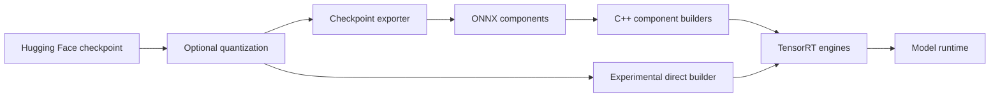

# Overview

TensorRT Edge-LLM is NVIDIA's C++ inference runtime for generative models on
NVIDIA Jetson, NVIDIA DRIVE, and NVIDIA DGX Spark. It supports text, image,
audio, speech, and action workflows while keeping the deployment runtime free
of Python dependencies.

See the [support matrix](user_guide/getting_started/support-matrix.md) for the
release software stacks and [supported models](user_guide/getting_started/supported-models.md)
for checkpoint IDs.

## Deployment Workflows

TensorRT Edge-LLM provides two engine frontends. Both produce artifacts consumed
by the same C++ runtimes.

| Frontend | Command | Use it for |
|---|---|---|
| ONNX workflow | `tensorrt-edgellm-export`, then component C++ builders | Supported deployment path, portable intermediate artifacts, and explicit component control |
| Direct frontend | `tensorrt-edgellm-build` | Experimental on-device compilation directly from a local checkpoint |

Quantization is optional. Unquantized and supported pre-quantized checkpoints can
be compiled directly; use `tensorrt-edgellm-quantize` only to create a new
quantized checkpoint.

## Runtime Capabilities

- Paged attention, FP8 KV cache, LoRA, streaming, and KV cache reuse
- EAGLE3, MTP, DFlash, and DSpark speculative decoding on supported models
- Image and audio encoders, speech generation, ASR, and action generation
- Model-specific runtimes for pipelines whose I/O contract is not LLM-shaped
- Experimental Python API and OpenAI-compatible server over the C++ runtime

Feature availability depends on the model and deployment. In particular,
[KV cache reuse](user_guide/getting_started/support-matrix.md#kv-cache-reuse-support)
has a narrower support boundary than ordinary inference.

## Start Here

1. [Install the Python package and C++ runtime](user_guide/getting_started/installation.md).
2. [Run the text-generation quick start](user_guide/getting_started/quick-start-guide.md).
3. Select a modality-specific workflow from the [examples](user_guide/examples/index.md).

For implementation details, see the
[checkpoint exporter](developer_guide/software-design/checkpoint-export.md),
[direct builder](developer_guide/software-design/onnxless-builder.md), and
[C++ runtime](developer_guide/software-design/cpp-runtime-overview.md) design guides.
